<h1 align="center">EAdam Optimizier</h1>
<h3 align="center">EAdam OPtimizer: How Epsilon Impact Adam</h3>

## Introduction
* We find that simply changing the position of epsilon can obtain better performance than Adam through experiments.
Based on this finding, we propose a new variant of Adam called EAdam, which doesn't need extra hyper-parameters or computational costs.  We also discuss the relationships and differences between our method and Adam. We perform a thorough evaluation of our EAdam optimizer against popular and latest optimization methods including Adam, RAdam and Adabelief on different deep learning tasks.  We focus on these following tasks: image classification on CIFAR-10 and CIFAR-100, language modeling on Penn Treebank  and object detection on PASCAL VOC. 

## Algorithm

    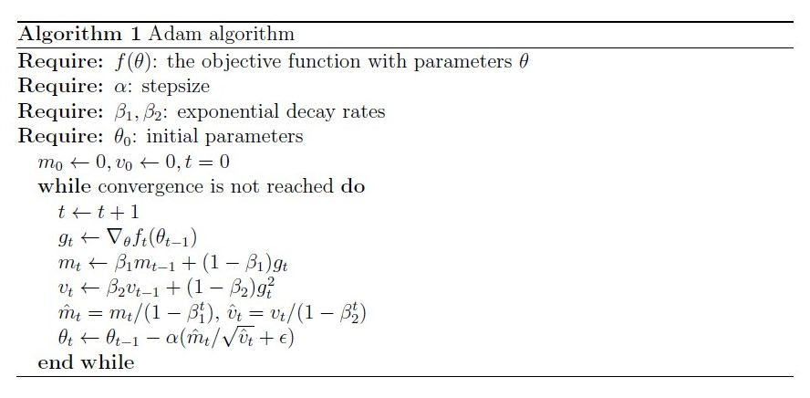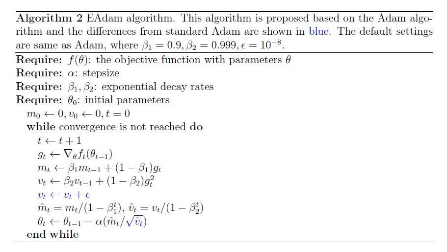

* According to update formulas in Algorithms, Vt can be expressed by the gradients at all previous timesteps as follows

  * 

        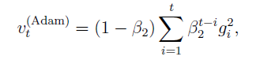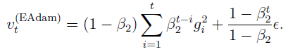
    

* After the bias correction step, we have

  * 

        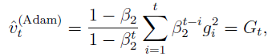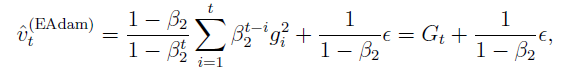
    

* Then， the adaptive stepsize are

  * 

    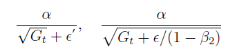 

* We firstly let  , then we want to analyse the differences of stepsizes when using Adam and EAdam to train deep networks. At the begin of training, the elements in  are far larger than  and , the stepsizes in Adam and EAdam can all approximated as . In this case, the stepsize is determined by . Then, the elements in  may become small and  or  can affect the elements in . In this case, the stepsize is determined by  and (). It easy to see that this case happens earlier in EAdam because  is added to  rather than. Finally, the elements in  may become far smaller than  or , and the stepsizes become

  * 

    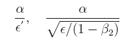 

    
  * In this case, EAdam takes smaller stepsize than Adam. 

*  We can see that EAdam essentially adds a constant times of  to  before the square root operation. However, this operation is not equivalent to adding a fixed constant  to . In other words, we can't find a fixed constant  such that , where  is known, for the following reasons. If we let  where  is known. Then, we have

  

   

  
* Because  is constantly updated,  is also adjusted based on  in the iterative process. Therefore,  is not fixed. From this interpretation, the change in EAdam can be seen as adopting an adaptive  rather than a constant in Adam. To sum up, we give some intuitive comparisons and explanations for EAdam in this subsection. However, analyzing the reasons why EAdam performances better in theory may be difficult and it is worthy to be further studied.

## Experiments

We did not precisely adjust the parameters and repeat the experiment, which will be supplemented in the future.

Code is base on:

* https://github.com/juntang-zhuang/Adabelief-Optimizer
* https://github.com/Luolc/AdaBound
* https://github.com/open-mmlab/mmdetection

#### CIFAR10 and CIFAR100

* Experiment is base on torch1.4.0

* Parameter Settings for all methods are shown in the following table

* | lr   | beta1 | beta2 | eps  | weight decay | batch size |
  | ---- | ----- | ----- | ---- | ------------ | ---------- |
  | 1e-3 | 0.9   | 0.999 | 1e-8 | 5e-4         | 128        |

* **Results:**

  
    
  	 
  

  
    
  	 
  

  

  

  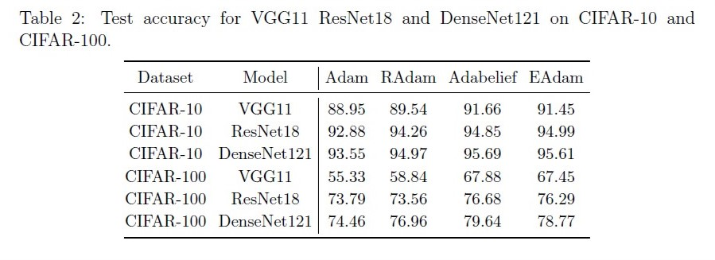 

#### Penn Treebank

* Experiment is base on torch1.1.0

* Parameter Settings  shown in the following table

* | model        | lr                  | beta1 | beta2 | eps                                 | weight decay | batch size |
  | ------------ | ------------------- | ----- | ----- | ----------------------------------- | ------------ | ---------- |
  | 1-layer LSTM | 1e-3                | 0.9   | 0.999 | 1e-8(EAdam and AdaBelief are 1e-16) | 1.2e-6       | 20         |
  | 2-layer LSTM | 1e-2(RAdam is 1e-3) | 0.9   | 0.999 | 1e-8(EAdam and AdaBelief are 1e-16) | 1.2e-6       | 20         |
  | 2-layer LSTM | 1e-2(RAdam is 1e-3) | 0.9   | 0.999 | 1e-8(EAdam and AdaBelief are 1e-16) | 1.2e-6       | 20         |

* **Results:**

  
    
  	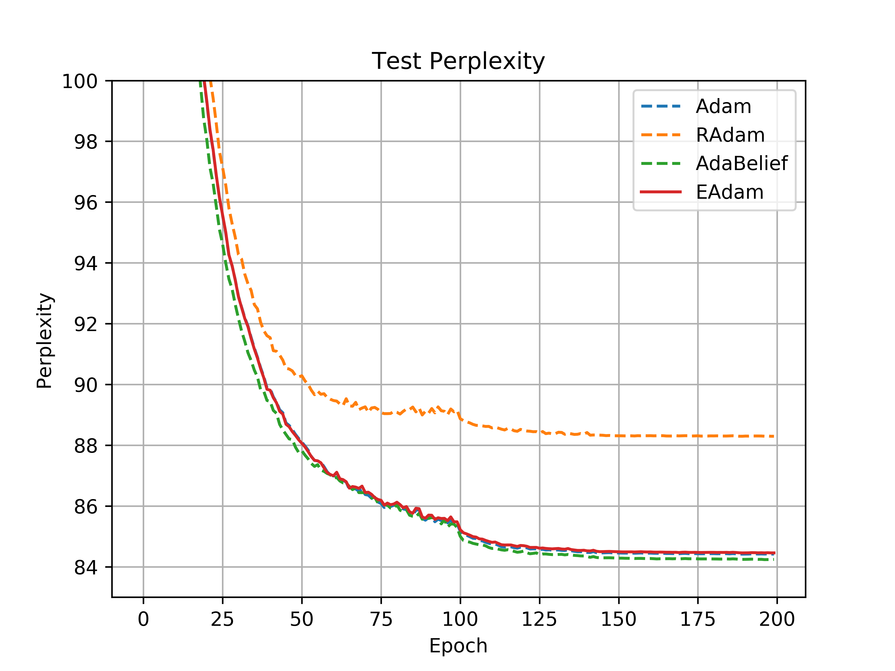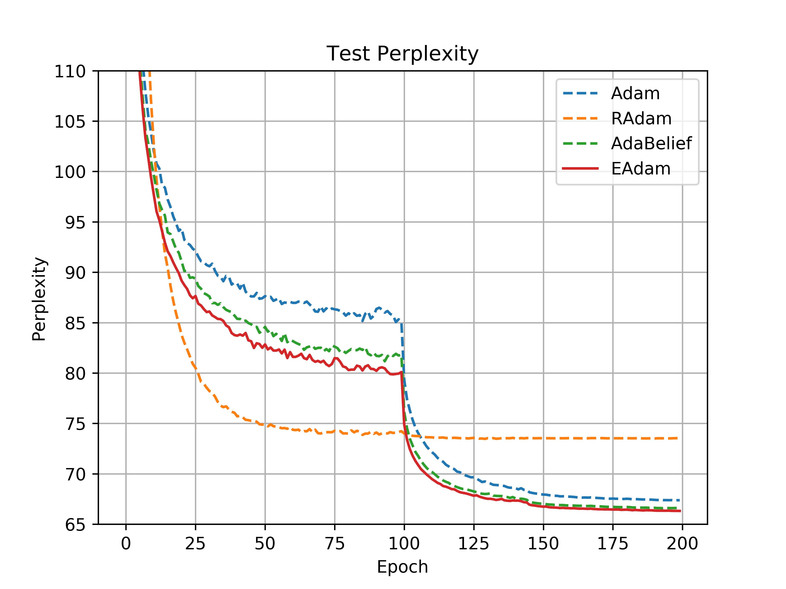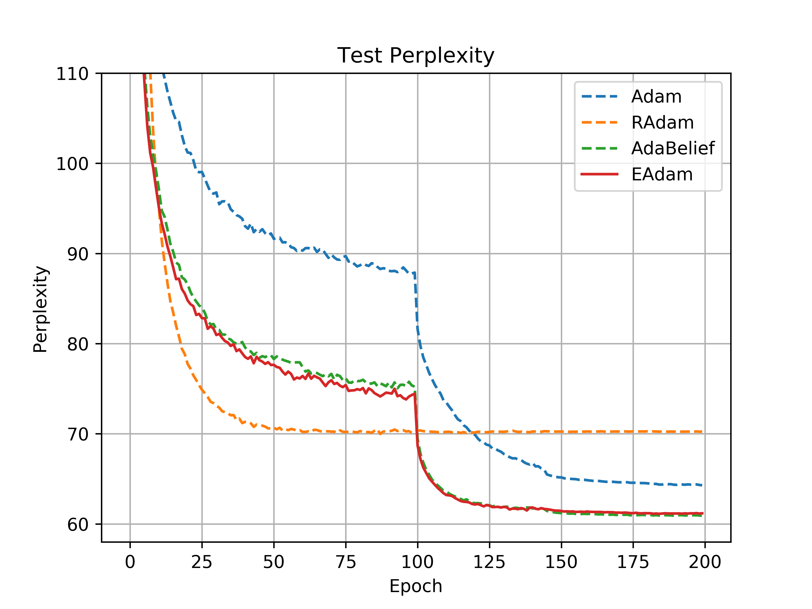 
  

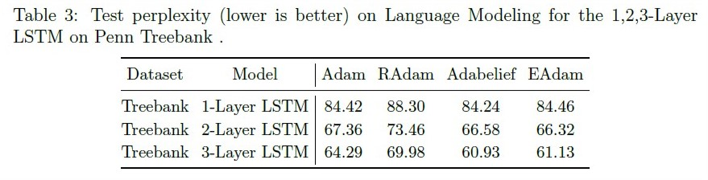 

#### Pascal Voc

* Experiment is base on torch1.6.0, torchvision0.7.0 and mmcv-full1.1.6

* Parameter Settings for all methods are shown in the following table

* | lr   | beta1 | beta2 | eps  | weight decay | batch size |
  | ---- | ----- | ----- | ---- | ------------ | ---------- |
  | 1e-4 | 0.9   | 0.999 | 1e-8 | 1e-4         | 2          |

* **Results:**

  

  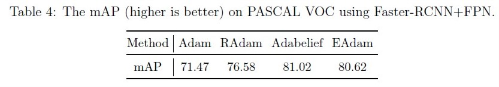 

  

  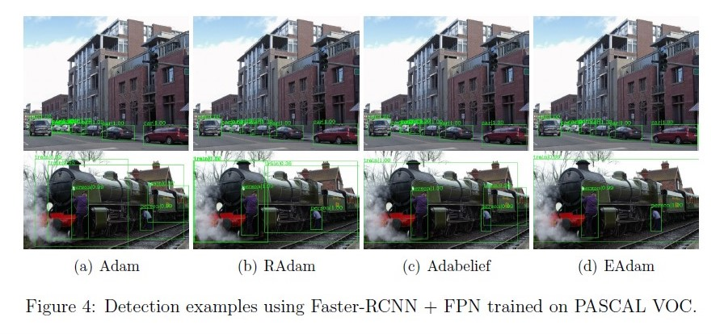 

## Plan

* We will precisely adjust the parameters and repeat the experiment in the future. We may add extra experiments incluing image classification on ImageNet and objective detection on COCO. More experimental data will be published in this repository in the future.